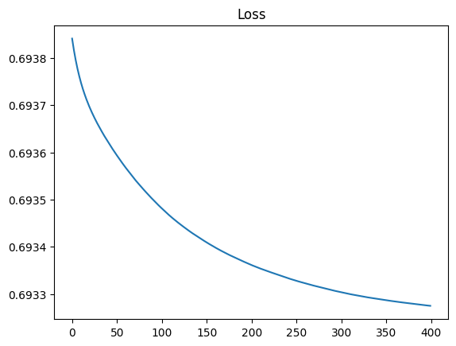

# Churn Prediction for Sunbase

## Running Streamlit webapp
```
cd sunbase_churn/
pip install -r requirements.txt
streamlit run webapp.py
```
###  What is churn ?

###  Churn rate, sometimes known as attrition rate, is the rate at which customers stop doing business with a company over a given period of time. 

## About Dataset
This datasent contains 100000 Rows and 9 columns of different features.

### We have six relevant features and one target
- Features
    - Age,
    - Gender
    - Location
    - Subscription_Length_Months
    - Monthly_Bill
    - Total_Usage_GB
- Target
    - Churn

## Model Arcitecture
```
ChurnModel(
  (linear1): Linear(in_features=6, out_features=12, bias=True)
  (relu): ReLU()
  (linear2): Linear(in_features=12, out_features=1, bias=True)
  (sigmoid): Sigmoid()
)
```
## Trained for 20000 iterations

